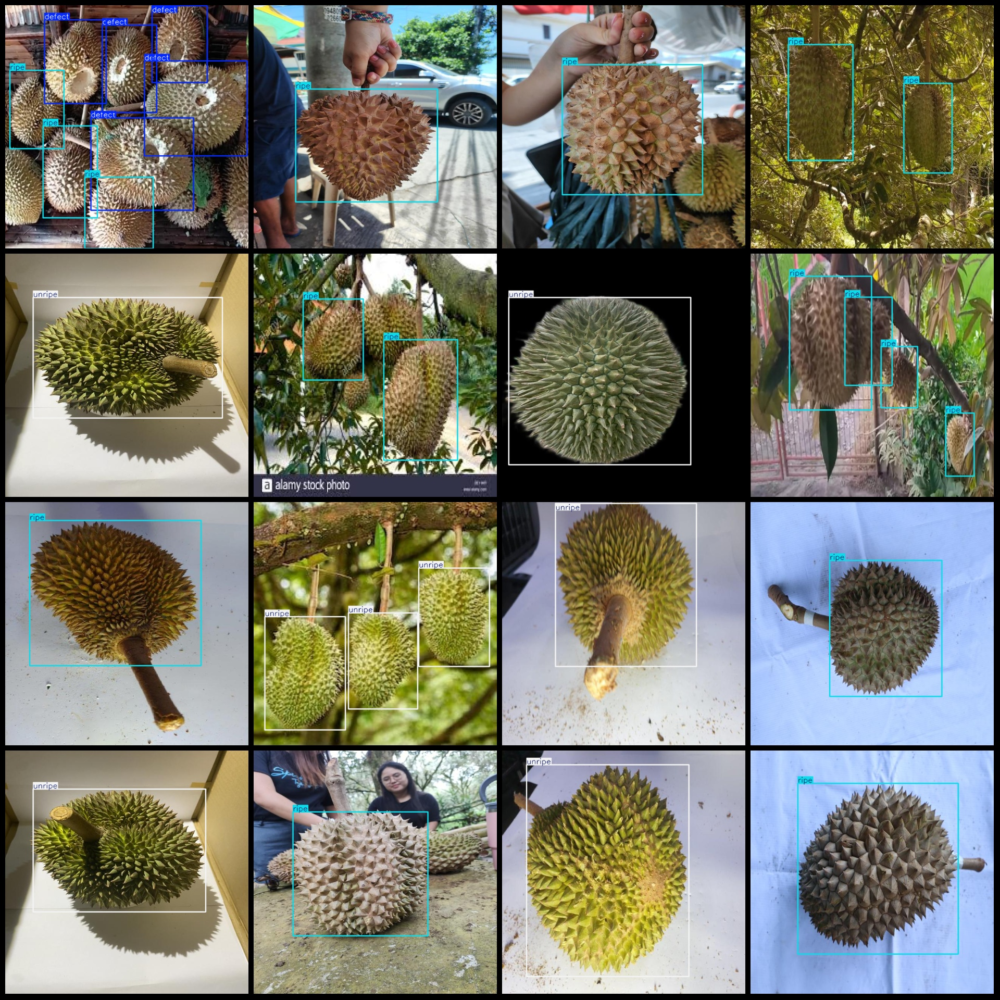
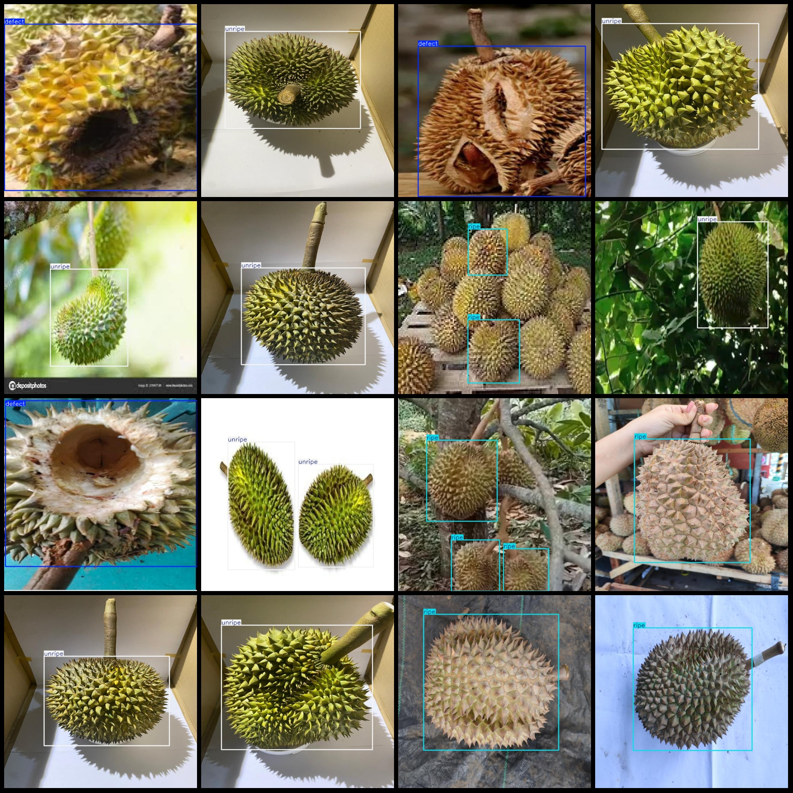

# Mango Ripeness Detection Dataset VOC+YOLO Format with 2552 Images in 3 Categories

The dataset format: Pascal VOC format + YOLO format (without split paths in the txt file, only containing jpg images along with corresponding VOC format xml files and YOLO format txt files).
Image count (number of jpg files): 2552
Annotation count (number of xml files): 2552
Annotation count (number of txt files): 2552
Number of categories: 3
Label names (note that the order of labels in the YOLO format does not match this, but is based on the "labels" folder's "classes.txt"): ["defect", "ripe", "unripe"]
Number of bounding boxes for each category:
- defect (defect) = 268
- ripe (ripe) = 1883
- unripe (unripe) = 1521
Total bounding boxes: 3672
Number of images per category:
- defect (defect) = 226
- ripe (ripe) = 1296
- unripe (unripe) = 1059
Image resolution: 640x640
Annotation tool used: labelImg
Annotation rules: draw rectangular bounding boxes for the categories
Important note: The dataset does not have separate training, validation, or test sets; you need to partition them yourself.
Special declaration: This dataset does not guarantee the accuracy of the trained models or weight files.
Image preview:
Annotation example:

## Images

Here is a pay link on Stripe ( https://buy.stripe.com/3cs8yP7sY87d0vu9AB ). Please contact me lonlonago@foxmail.com after funding $89, and I will send you a complete data files , thank you!

